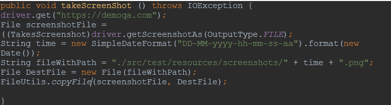
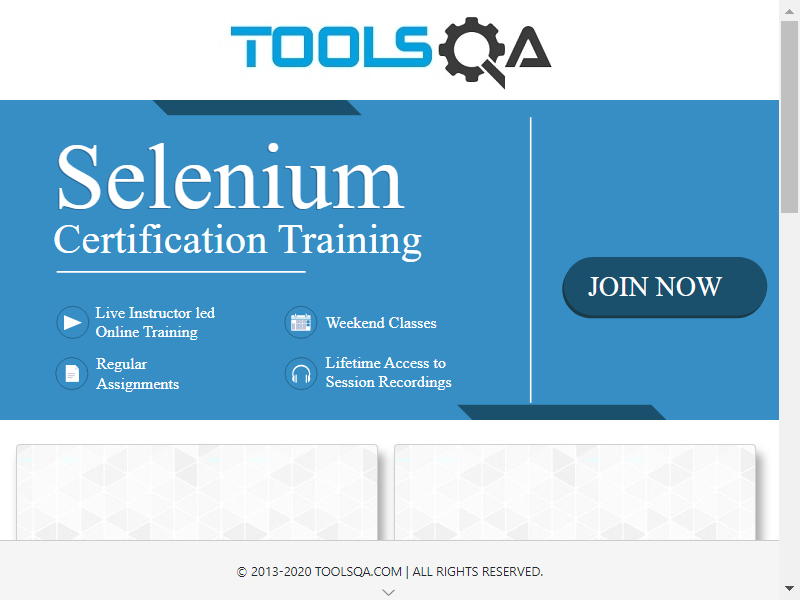

<h1 align="center">Questionnaire-for-SQA-Engineer-Interview</h1>

## :pushpin: Following question are
:one: **Explain the steps for Bug Cycle?**

The bug cycle, also known as the software development life cycle (SDLC), is a series of steps that software developers follow to create a high-quality product. The specific steps in the bug cycle can vary depending on the methodology being used, but typically it includes the following stages:

- Planning: In this stage, the development team defines the goals and objectives of the software project, as well as the requirements and constraints.

- Analysis: In this stage, the development team analyzes the project requirements and identifies any potential issues or challenges that need to be addressed.

- Design: In this stage, the development team designs the overall structure and architecture of the software, as well as the individual components and features.

- Implementation: In this stage, the development team writes the code for the software and integrates it with any third-party libraries or frameworks.

- Testing: In this stage, the development team tests the software to ensure that it functions as expected and meets the specified requirements. This may include both manual testing by the development team and automated testing using tools such as unit tests and integration tests.

- Deployment: In this stage, the software is released to users and made available for download or use.

- Maintenance: In this stage, the development team provides ongoing support for the software, including bug fixes, updates, and new features.

:two: **What is meant by boundary value analysis?**

The technique of boundary value analysis is used to choose test data. The values chosen by the test engineer are those that are near the data edges. Max, Min, Just Inside, Just Outside, Typical Values, and Error Values are all included. The test cases are written using a technique called boundary value analysis. 
For instance: A software system accepts birthday of members only from 15 to 90 years. <15 is invalid, 15-90 is valid and >90 valid. Check boundary value and then Minimum-1, minimum +1 and maximum+1, maximum-1. Overall, boundary value analysis is an important technique for identifying potential errors in software and ensuring that it is reliable and stable.

:three: **What is Agile testing and what is the importance of Agile testing?**

In a dynamic environment where testing requirements are always changing to meet client expectations, a QA practices agile testing. The testing team frequently receives minor codes from the development team for testing as it is done concurrently with development activities. 
- Client satisfaction by continuous delivery of software.
- Client, developers and testers constantly interact with each other.
- Software is regularly delivered that is functional.
- Focus on both technical excellence and good design.
- Even late changes in requirements are accepted.
#### **when starting the Agile model:**
- It is relatively inexpensive to introduce new changes.
- The developers only need to miss a few days of work to add a new feature.
- In contrast to the waterfall paradigm, the agile style requires very little planning before the project can begin.

:four: **Explain Low Severity & High Priority Bug?**

A low severity and high priority bug is a type of software defect that has a minor impact on the functionality of the software, but is considered to be highly important by the development team.

Good example is Images not updated. Another example, the customer will waste money because the printing task is still outstanding if the printer prints several copies rather than a single copy. This can be fixed in the following product release.

:five: **List the basic components of the defect report format.**

The defect report contains the project, product name, released version, product build, and the software module where the flaw was discovered, as well as a special identification number by which the defect is recorded in the bug tracking program. The defect report will include a summary of the defect, a description of the problem and the procedures taken to recreate it, the actual result, the anticipated outcome, and the defect severity, i.e., the severity of the defect's detrimental influence on the quality of the software: critical, major, minor, or trivial, the defect's priority, or how urgently it needs to be fixed, Name of the developer who will be tasked with fixing the fault, as well as the tester who found it. According to the bug life cycle, the defect's current status depends on whether it is still new, assigned, open, resolved by the developer, being tested by the tester, fixed, or closed.

:six: **How do you take screenshots in Selenium Web Driver?**

##### Add this library into gradle:
***commons-io repository***
|  |
| :------------------------------------------:|
|               _Selenium Screenshot Code_              |

|  |
| :------------------------------------------:|
|               _Selenium Genereted Screenshot_              |

:seven: **Explain regression and confirmation testing.**

- Regression Testing: 
Regression testing is the process of determining whether newly added feature is creating any faults in interim functionalities, and whether common functionalities are stable in both the most recent and earlier versions.
- Confirmation testing: 
Confirmation is a type of change-related tests performed after a defect is corrected to ensure a failure based on by that defect doesn't happen again.

:eight: **Explain how do you arrive at a project estimation?**
#### The following project estimation technique are:

- **Estimates made by an expert**
The degree to which a new project follows to experience and the expert's ability to recall details of previous projects both have a significant impact on the trustworthiness of estimates based on expert judgment. The estimates are typically qualitative rather than being objective. It is challenging for someone else to replicate and apply an expert's knowledge and expertise while utilizing this method, which is a significant flaw.
- **Estimates using reasoning by analogy**
An evaluated database of comparable historical projects, project sections, or project modules serves as the basis for a cost prediction technique based on reasoning by analogy. It is required to gather and document information about previous projects in order to compare a new project to one or more completed projects and determine whether there are any similarities.
- **Estimates using Price-to-Win**
It is difficult to consider the Price-to-Win strategy a SCE technique. The main motivation for implementing this strategy is business. It is amazing that firms using Price-to-Win have estimations that are just as precise as those using alternative methodologies.
- **Estimates using available capacity**
The availability of resources, particularly of manpower, is the foundation of the estimating method, which views SCE as a capacity problem. Here's an illustration from the capacity planning: Over the following four months, the new project will be able to use three personnel.
- **Estimates using the use of parametric models**
The development time and effort are calculated using parametric models as a function of several parameters. The major cost determinants are these elements. Numerous techniques and parameters form the foundation of an estimation model. In large part, the parameters' values and the types of algorithms are determined by the information in a database of finished projects.

:nine: **What is the purpose of exit criteria?**

The purpose of exit criteria is when to stop testing. Exit criteria are a set of requirements that must be satisfied in order to end the STLC phase. 
**Stages of Exit Criteria:**
- Verify the expected outputs
- Detailed Incident Reports
- Maintenance Handover
- Finish and archive the testware
- Document system approval

